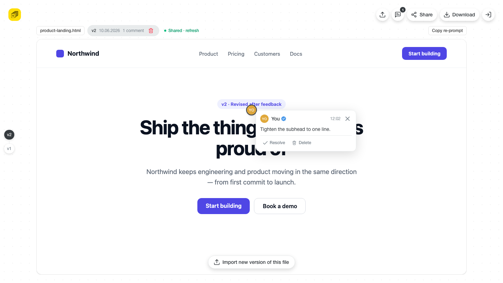

# AI Feedback Loop

> **Turn AI‑generated HTML into team‑approved HTML.**

**[Live → html.fileverse.io](https://html.fileverse.io)** · open source (GPL‑3.0)

Got an HTML page from an AI agent and want your team to weigh in? Drop the file
in, click on anything to leave a comment, and share a link. When everyone’s
feedback is in, export the page with all the notes baked in — ready to paste
straight back to Claude, Cursor, ChatGPT, or Grok.


---

## Why

Giving feedback on an AI‑generated page is awkward. You end up writing things
like *“make the button under the heading a bit bigger”* and hoping the model
guesses which button. This tool lets anyone point **right at** an element and
leave a note there — so the feedback is unambiguous, and you can hand it back to
the AI without re‑explaining.

## How it works

1. **Import** — drop in an `.html` file (or try a sample). A shareable link is
   ready right away.
2. **Comment** — click anything in the preview to pin a note to it.
3. **Share** — send the link. Add a password if the review should be private.
4. **Review** — anyone with the link opens the same page and adds their comments.
5. **See it come back** — their feedback shows up next to yours, automatically.
6. **Re‑prompt** — **Copy comments** to paste the whole feedback summary into
   your AI chat, or **Download** the page with every note baked in.
7. **Iterate** — once the AI fixes things, import the new version. Each file
   keeps up to **3 versions**, and every version has its own round of comments.



Reviews can be locked behind a password, and if a shared file gets deleted,
anyone opening the old link sees a friendly “this file is gone” page.


---

## Run it locally

```bash
npm install
cp .env.example .env.local   # add your two Supabase values (see below)
npm run dev                  # http://localhost:5173
```

You can import, comment, and export **without any setup** — that all runs in your
browser. Sharing review links is the only part that needs a database.

For sharing, add two browser‑safe values from your Supabase project
(**Settings → API**) to `.env.local`:

```ini
VITE_SUPABASE_URL=https://YOUR-PROJECT.supabase.co
VITE_SUPABASE_ANON_KEY=sb_publishable_…
```

Then set up the database tables by running the SQL files in
[`supabase/migrations/`](supabase/migrations/) once, in order, from the Supabase
SQL Editor.

## Deploy

It’s a plain static site, so it deploys anywhere (the live version runs on
Vercel at **[html.fileverse.io](https://html.fileverse.io)**). Point your host at
`npm run build`, serve the `dist/` folder, and add the same two Supabase values
as environment variables.

---

## Under the hood

A few notes for the curious:

- **Pins that stick** — your imported page renders in a locked‑down sandbox, and
  each comment is anchored to the element you clicked so it stays put even after
  the AI rewrites the page for the next version.
- **Private by design** — the database can’t be read directly; everything goes
  through guarded access points. Passwords are hashed and never leave the server,
  and only the file’s owner can rename, reset the password, or delete it.
- **Built with** React, Vite, Tailwind CSS, and Supabase — all open source.

## Good to know

- It’s a focused proof of concept: one project per browser at a time, up to 3
  versions per file.
- Reviewers are anonymous (name only) — no accounts to create.
- Feedback syncs every few seconds rather than instantly.

## License

[GNU GPL v3](LICENSE) © Fileverse
