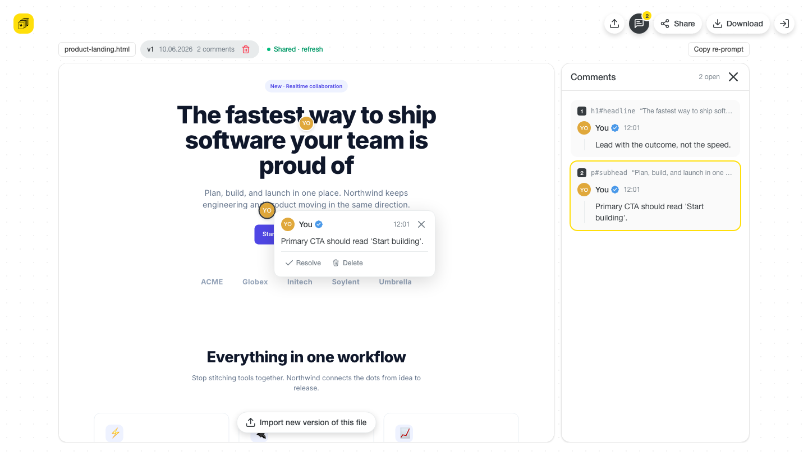
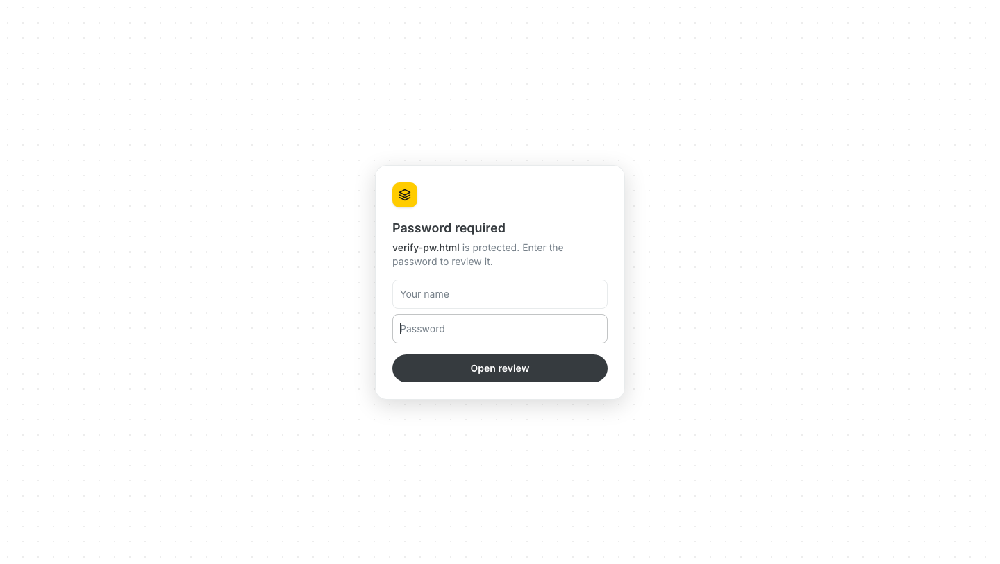

# AI Feedback Loop

**Multiplayer comments for AI‑generated HTML.** Import an `.html` file, leave
feedback pinned to individual elements, share a review link (optionally
password‑protected), iterate across up to 3 versions, then export the file with
all feedback **baked in and ready to re‑prompt** your AI agent.



---

## Why

When an AI generates an HTML page, giving precise feedback is painful — you
can’t easily point at *“this button”* or *“that heading.”* This tool lets anyone
drop comments **directly on elements**, anchored stably enough that the feedback
maps back to the markup, so you can hand it straight back to the model.

## The loop

1. **Import** — drop an HTML file (or pick a sample). A public **share link is
   created immediately** (password‑less by default) — no separate “create link”
   step.
2. **Comment** — click any element in the live preview to pin feedback to it
   (works on bare text directly inside `<body>` too).
3. **Share** — the share card is open by default with the live link; tick
   **Password required** to set one, **Reset** to change it, untick to disable
   (with a confirm).
4. **Review** — anyone with the link (and password) adds comments on the live
   preview. They land on the **latest version** and can switch to read older
   ones.
5. **Sync back** — a shared doc reads its comments from Supabase, so guest
   feedback shows up in your editor (polled every ~10s; **Refresh** to pull now).
6. **Re‑prompt** — **Copy re‑prompt** for a paste‑into‑chat summary, or
   **Download** the HTML with all feedback baked in (from the editor **or** the
   review link).
7. **Iterate (versions)** — fix the feedback with your agent, then **Import new
   version of this file** to add **v2** (up to 3). Each version is a fresh review
   round with its own comments; switch between versions from the rail in the left
   margin; delete a version (or the whole file) from the title‑pill trash.

## Stack

- **React 19** + **React Router 7** + **Zustand 5** (persisted to `localStorage`)
- **Vite 8** + **TypeScript** (strict) + **Tailwind CSS 4**
- **Supabase** (Postgres) for shared links — RLS‑locked, password‑gated RPCs
- Node **20.19+**

---

## Quick start

```bash
npm install
cp .env.example .env.local   # then fill in the two values (see below)
npm run dev                  # http://localhost:5173
```

`npm run build` type‑checks (`tsc --noEmit`) and produces a production bundle;
`npm run preview` serves it.

### Environment

`.env.local` (git‑ignored) needs two **browser‑safe** values from Supabase →
**Settings → API**:

```ini
VITE_SUPABASE_URL=https://YOUR-PROJECT.supabase.co
VITE_SUPABASE_ANON_KEY=sb_publishable_…   # the "publishable" key (new format)
```

> The app works fully **without** Supabase — import, comment and export are all
> local. Only **Share / review links** require these keys.

### Database schema

The shared‑link schema lives in [`supabase/migrations/`](supabase/migrations/).
Apply them once per project, **in order**, easiest via the Supabase **SQL
Editor** (or `psql "$DATABASE_URL" -f <file>`):

| File | What it adds |
| --- | --- |
| `0001_init.sql` | `shares` + `comments`, RLS‑locked, password‑gated RPCs |
| `0002_fix_pgcrypto_schema.sql` | schema‑qualify pgcrypto (`extensions.*`) |
| `0003_sync.sql` | `list_comments` + `delete_comment` for sync‑back |
| `0004_password_and_delete.sql` | set/reset/disable password, delete share |
| `0005_owner_token.sql` | secret **owner token**; gates destructive actions |
| `0006_versions.sql` | `versions` table; comments move to `version_id`; add/delete/switch versions (max 3) |

### Deploy (Vercel)

It's a static Vite SPA, so deployment is just the build output:

1. Import the repo into Vercel (framework preset: **Vite**, build `npm run build`,
   output `dist`).
2. Add the same env vars under **Settings → Environment Variables** — without
   them, Share/Review won't work in production:
   - `VITE_SUPABASE_URL`
   - `VITE_SUPABASE_ANON_KEY`
3. [`vercel.json`](vercel.json) rewrites all non‑file routes to `index.html` so
   client routes (`/editor`, `/r/:id`) don't 404 on refresh. Static assets are
   served from the filesystem first, so they're unaffected.

---

## How it works

### Anchoring engine (the core)

The previewed HTML runs inside a **sandboxed iframe** (`allow-scripts`, **not**
`allow-same-origin`) so untrusted markup can’t touch the host app. A small agent
([`features/preview/agent.js`](src/features/preview/agent.js)) is injected into
the iframe and talks to the host only via `postMessage`. When you click an
element it captures a 3‑layer anchor — **`elementId` → `nth-of-type` selector →
text quote** — so a pin survives edits and can re‑resolve onto a re‑imported v2
of the file. The host maps reported element rects to an absolute pin overlay.

### Versions (review rounds)

A share is a **project holding 1–3 versions**. Each version is an immutable
snapshot with **its own HTML and its own comments** — so uploading v2 starts a
clean review round after v1’s feedback was applied. The link is stable;
reviewers see the latest version and can switch to read older ones (read‑only).
Deleting a version renumbers the rest; deleting the last one tears down the
whole share. Schema: a `versions` table, with `comments` referencing
`version_id`; `get_share(…, version_no)`, `add_version`, `delete_version`.

### Sharing & security (password + owner token)

- Tables `shares`, `versions`, `comments` have **RLS enabled with no policies**,
  so the publishable key has **zero direct table access**.
- All reads/writes go through **`SECURITY DEFINER` RPCs**. Reads are **password‑
  gated**; passwords are **bcrypt‑hashed** with pgcrypto and never leave the DB.
- Because shares are auto‑created (often password‑less), destructive actions
  can’t rely on the password — anyone with the link would pass. So `create_share`
  returns a secret **owner token** (kept in the owner’s `localStorage`), and
  `set_share_password` / `delete_version` require it. Max‑3 versions is enforced
  server‑side too.
- If the persisted share ever goes missing server‑side (e.g. the DB was wiped),
  the editor detects it via `share_meta` and **re‑creates a fresh share** on the
  next open, so a stale `localStorage` id can’t leave you broken.



### Export (built for agent pickup)

[`features/export/exportDoc.ts`](src/features/export/exportDoc.ts) bakes the
feedback into the downloaded HTML three reinforcing ways: a top‑of‑`<head>`
**re‑prompt directive** (open comments, each with element label · selector ·
quote · author), **inline `data-feedback` attributes** on the targeted elements
(so an agentic editor sees the ask where it edits), and a
`<script type="application/json">` **snapshot** of all comments for re‑import.
**Copy re‑prompt** puts the same summary on the clipboard for a chat paste.

## Project structure

```
src/
  routes/        Landing · Editor · Review (public viewer)
  features/
    preview/     sandboxed iframe + anchoring agent
    comments/    drawer, comment card, composer, avatar, controllers
    import/      file read + "Reading HTML file" state
    export/      bake feedback into the HTML file
    share/       supabase RPC wrappers + share popover
    versions/    version rail (left-margin switcher)
  store/         zustand stores (doc · comments · shares, persisted)
  components/    TopBar, icons (Figma SVGs)
  lib/           supabase client, cn()
supabase/migrations/   shares/versions/comments schema + RPCs
```

## Known limitations (it’s a POC)

- One project per browser at a time (the active doc is kept in `localStorage`).
  Each **version** is a one‑time markup snapshot — editing the file after upload
  won’t update that version; import a new version instead. Comments sync both
  ways.
- Up to **3 versions** per share; importing a 4th is blocked until you delete one.
- Reviewers are anonymous (name only); no accounts. Ownership is proven by a
  secret **owner token** in the owner’s `localStorage` (lose it and you can’t
  manage the share remotely).
- Sync is **polled** (~10s), not realtime; Supabase Realtime would make it live.

## License

Open source.
